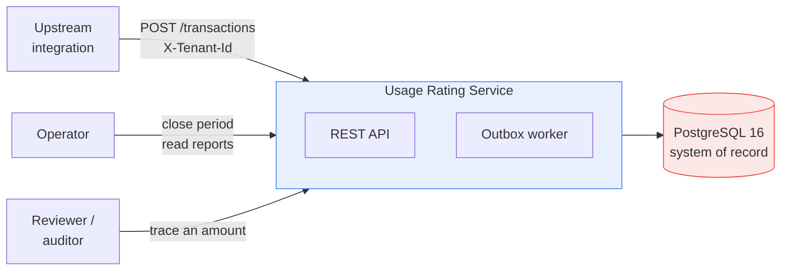
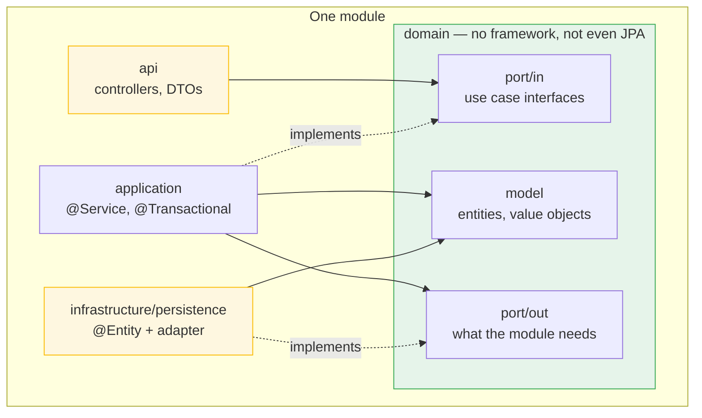
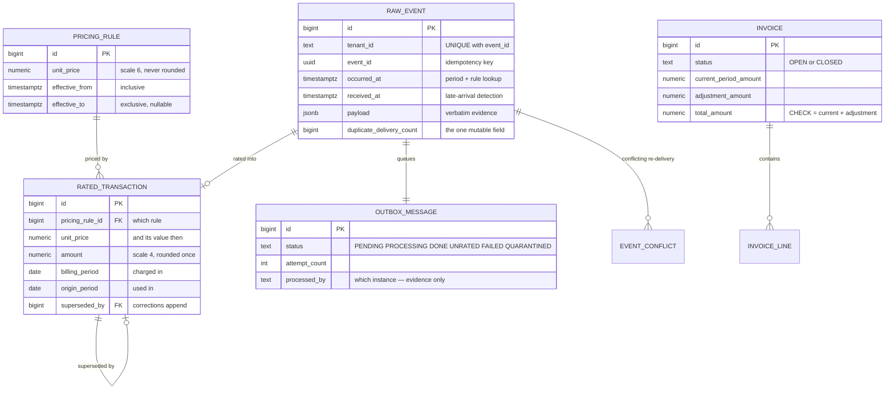
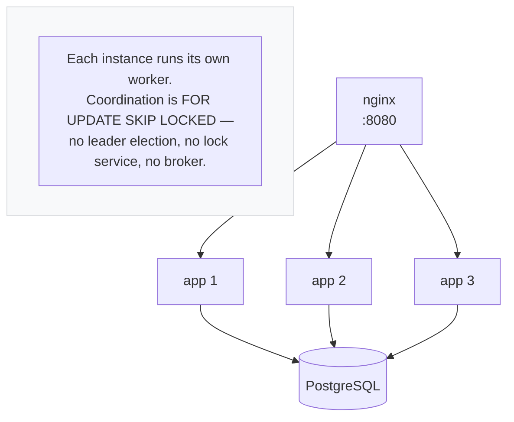

# Architecture

Diagrams render on GitHub and in any Mermaid-aware viewer.

---

## System context

What the service talks to, and what it owns.

The database is not an implementation detail here: uniqueness, non-overlapping pricing
validity and tenant isolation are all enforced in PostgreSQL, so the service cannot
violate them even with a bug in the application layer.

---

## How a module is sliced

Every module has the same four layers. The dependency rule is the whole of the
architecture: **arrows point inward, and `domain` points at nothing.**

The two yellow boxes are the replaceable edges; the green one holds the rules. That is
what lets rating, monetary arithmetic and period boundaries be unit-tested with no
Spring context and no database.

**The `@Entity` never leaves `infrastructure/persistence`.** It mirrors the *table* —
primitives, nullable columns, no invariants — and converts through `toDomain()` and a
`fromDomain()` in its companion. The domain model holds the typed values (`Money`,
`BillingPeriod`, `Quantity`) and enforces its invariants in `init`. The two shapes are
allowed to disagree, which is the point: `rated_transaction.currency` is a `CHAR(3)`
column and a `java.util.Currency` in the domain.

One consequence worth naming: a pure domain model cannot be a mutable JPA entity, so
`Invoice.close()` and `OutboxMessage.mark*()` return a new instance instead of mutating
in place. State transitions became values rather than side effects.

Round-trip unit tests cover every mapper. A mapper that silently drops a field is a real
failure mode — the amount would still be written, just under the wrong period.

---

## Modules and ports

Cross-module calls go through a port owned by the **consuming** module — the module
states what it needs, and the providing module supplies it. Never a full
`JpaRepository`: a read-only consumer does not get `save` and `deleteAll`.

| Out-port | Owned by | Implemented by | What it prevents |
| --- | --- | --- | --- |
| `PricingRuleLookup` | `pricing` | `pricing.infrastructure.persistence` | rating depending on JPA |
| `BillingPeriodStatusLookup` | `invoicing` | `invoicing.infrastructure.persistence` | rating importing invoicing internals |
| `ChargeLookup` | `invoicing` | `rating.infrastructure.persistence` | invoicing holding `save`/`delete` on the ledger |
| `RatingQueue` | `ingestion` | `processing.infrastructure` | ingestion holding `delete` on the work queue |
| `EventStore` | `ingestion` | `ingestion.infrastructure.persistence` | the raw-event entity escaping its package |
| `RatedTransactionStore` | `rating` | `rating.infrastructure.persistence` | the same, for the ledger |
| `InvoiceStore` | `invoicing` | `invoicing.infrastructure.persistence` | the same, for invoices |
| `OutboxMessageStore` | `processing` | `processing.infrastructure.persistence` | the same, for the queue |

Four of these removed **write access** a module had no business holding: invoicing could
have deleted rated transactions, ingestion could have emptied the outbox. The in-ports
(`IngestTransactionUseCase`, `RateTransactionUseCase`, `SummariseInvoiceUseCase`,
`ClosePeriodUseCase`, `DrainOutboxUseCase`, `ReconcileUseCase`) let controllers and the
scheduler depend on a named use case rather than on a concrete `@Service`.

`DependencyRuleTest` fails the build if any of this regresses, including on a stray
`jakarta.persistence` import under any `domain` package.

### Two places that stayed raw JDBC, deliberately

`OutboxClaimRepository` and `ReconciliationService` are not behind entity-based ports.

For the claim, `FOR UPDATE SKIP LOCKED` over a two-table join returning a projection
*is* the mechanism — routing it through a port would obscure the one line that matters.
For reconciliation, the queries span `raw_event`, `rejected_event`, `outbox_message`,
`rated_transaction` and `invoice` across five modules; modelling that as ports would
mean five round trips per report and would hide the very arithmetic the report exists to
make checkable. `ReconciliationService` does sit behind `ReconcileUseCase`, so its
callers still depend on an interface.

---

## Data model

Two splits carry the design:

**Evidence vs. result.** `raw_event` holds what arrived and is never rewritten;
`rated_transaction` holds what was calculated and can be recomputed. A correction
inserts a new rated row and points the old one at it via `superseded_by`.

**Two periods.** `origin_period` is when the usage happened, `billing_period` is when it
is charged. They differ only for a late arrival, and a `CHECK` keeps the flag and the two
periods consistent so no code path can set one without the other.

---

## Invariants enforced by the database

Not by application code, so a bug in the service cannot violate them.

| Invariant | Mechanism |
| --- | --- |
| One event bills at most once | `UNIQUE (tenant_id, event_id)` |
| One current rating per event | partial unique index `WHERE superseded_by IS NULL` |
| Pricing rules never overlap | `EXCLUDE USING gist` over `tstzrange` |
| An invoice total matches its parts | `CHECK (total = current + adjustment)` |
| A late adjustment's periods differ | `CHECK (is_late = (billing <> origin))` |
| No tenant reads another's rows | row-level security on all eight tables |

---

## Deployment

Two database roles, and the distinction is the whole of tenant isolation:

| Role | Used by | Privileges |
| --- | --- | --- |
| `usage_owner` | Liquibase | owns the tables, runs migrations |
| `usage_app` | the application | `NOBYPASSRLS`, owns nothing |

A superuser or a table owner bypasses row-level security unconditionally — even with
`FORCE ROW LEVEL SECURITY` — so the runtime role must be neither. Connecting as the owner
would leave every policy in place and enforcing nothing.
