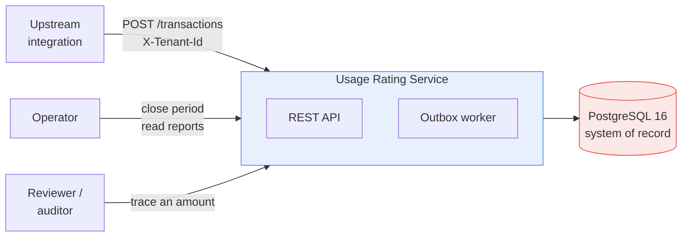
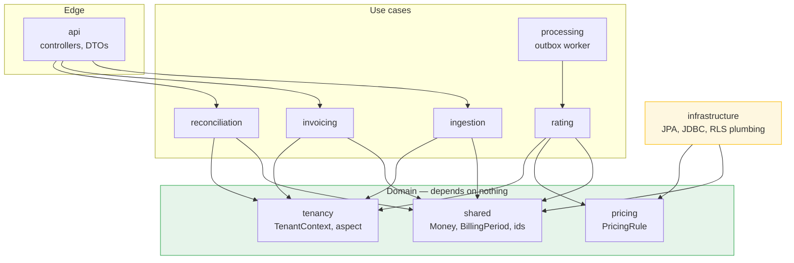
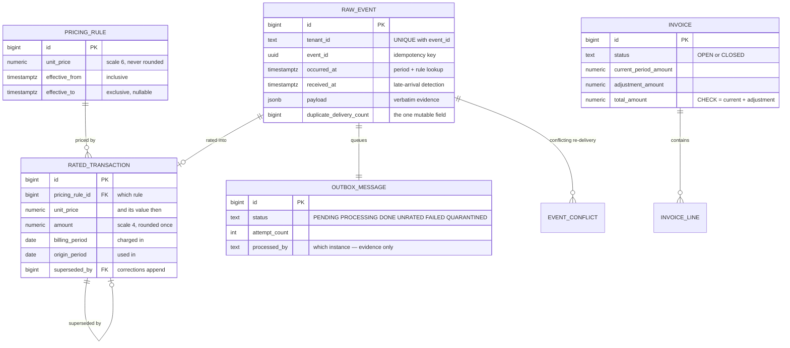
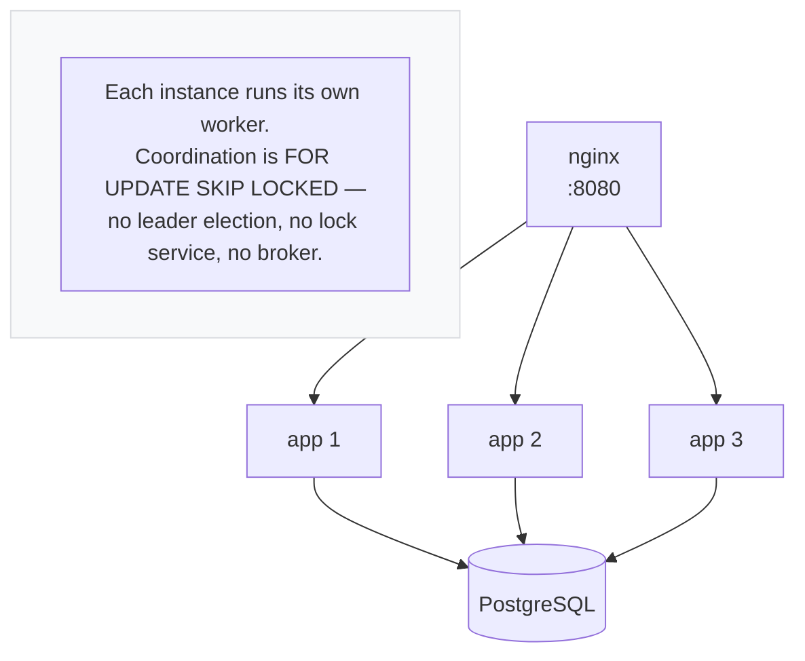

# Architecture

Diagrams render on GitHub and in any Mermaid-aware viewer.

---

## System context

What the service talks to, and what it owns.

The database is not an implementation detail here: uniqueness, non-overlapping pricing
validity and tenant isolation are all enforced in PostgreSQL, so the service cannot
violate them even with a bug in the application layer.

---

## Modules and dependencies

Arrows point inward. `domain` imports nothing from `api`, `application`,
`infrastructure`, or another module's internals — which is what lets the rating rules,
monetary arithmetic and period boundaries be unit-tested with no Spring context and no
database.

Cross-module calls go through a port owned by the **consuming** module — the module
states what it needs, and the providing module supplies it:

| Port | Owned by | Implemented by | What it prevents |
| --- | --- | --- | --- |
| `PricingRuleLookup` | `pricing.domain` | `pricing.infrastructure` | rating depending on JPA |
| `BillingPeriodStatusLookup` | `invoicing.domain` | `invoicing.infrastructure` | rating importing invoicing internals |
| `ChargeLookup` | `invoicing.domain` | `rating.infrastructure` | invoicing holding `save`/`delete` on the ledger |
| `RatingQueue` | `ingestion.domain` | `processing.infrastructure` | ingestion holding `delete` on the work queue |
| `RateableTransaction` | `rating.domain` | mapped by `processing` | rating being drivable only by the outbox |

Each of the last three replaced a direct dependency on another module's infrastructure.
Two of them also removed **write access** a module had no business holding: invoicing
could have deleted rated transactions, and ingestion could have emptied the outbox.
`DependencyRuleTest` now fails the build if any of these regress.

---

## Data model

Two splits carry the design:

**Evidence vs. result.** `raw_event` holds what arrived and is never rewritten;
`rated_transaction` holds what was calculated and can be recomputed. A correction
inserts a new rated row and points the old one at it via `superseded_by`.

**Two periods.** `origin_period` is when the usage happened, `billing_period` is when it
is charged. They differ only for a late arrival, and a `CHECK` keeps the flag and the two
periods consistent so no code path can set one without the other.

---

## Invariants enforced by the database

Not by application code, so a bug in the service cannot violate them.

| Invariant | Mechanism |
| --- | --- |
| One event bills at most once | `UNIQUE (tenant_id, event_id)` |
| One current rating per event | partial unique index `WHERE superseded_by IS NULL` |
| Pricing rules never overlap | `EXCLUDE USING gist` over `tstzrange` |
| An invoice total matches its parts | `CHECK (total = current + adjustment)` |
| A late adjustment's periods differ | `CHECK (is_late = (billing <> origin))` |
| No tenant reads another's rows | row-level security on all eight tables |

---

## Deployment

Two database roles, and the distinction is the whole of tenant isolation:

| Role | Used by | Privileges |
| --- | --- | --- |
| `usage_owner` | Liquibase | owns the tables, runs migrations |
| `usage_app` | the application | `NOBYPASSRLS`, owns nothing |

A superuser or a table owner bypasses row-level security unconditionally — even with
`FORCE ROW LEVEL SECURITY` — so the runtime role must be neither. Connecting as the owner
would leave every policy in place and enforcing nothing.
