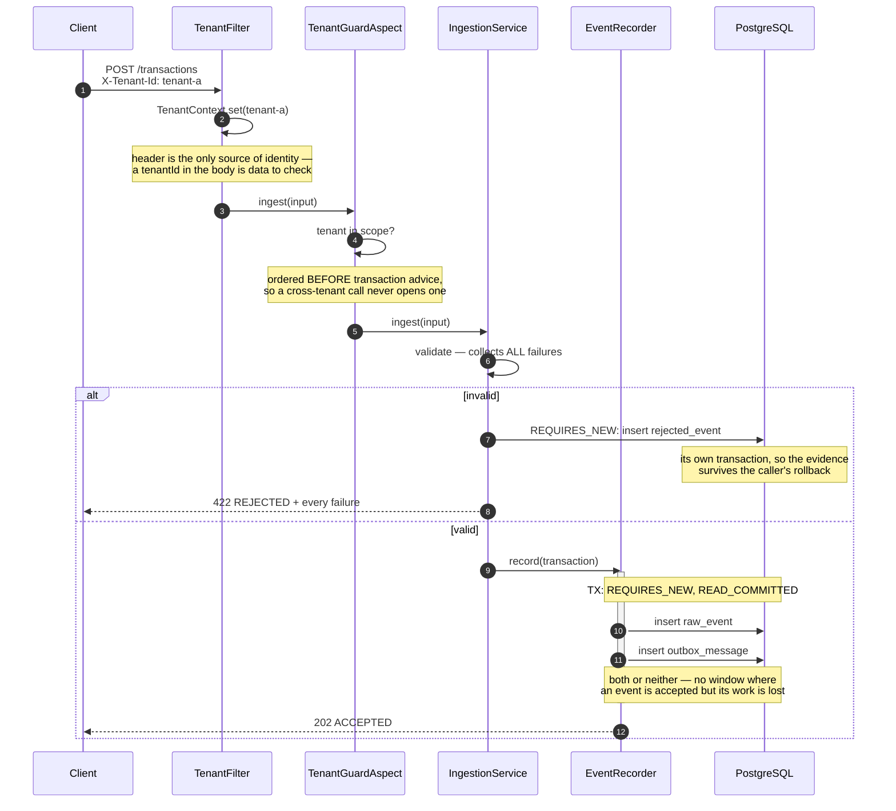
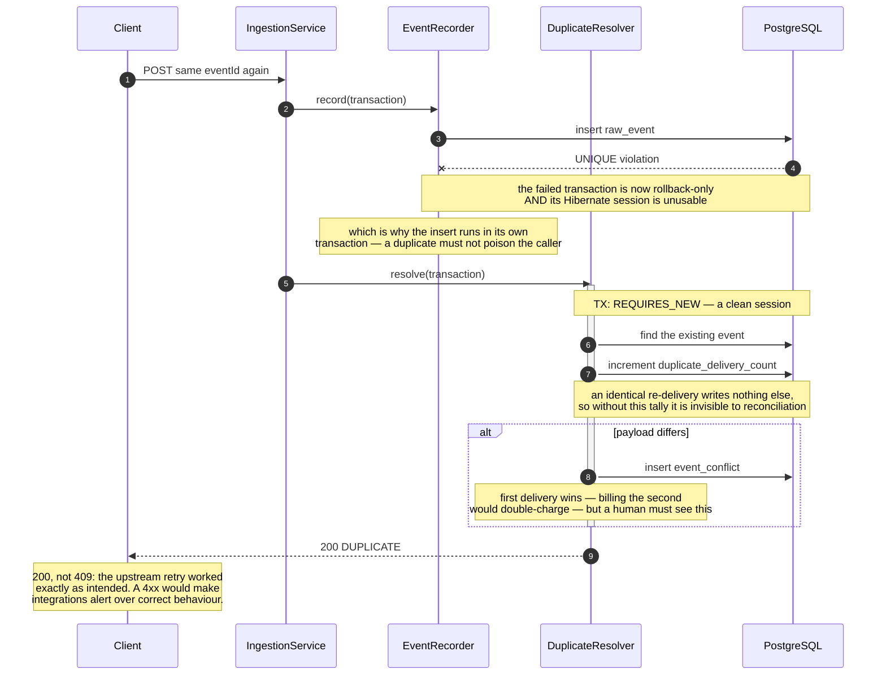
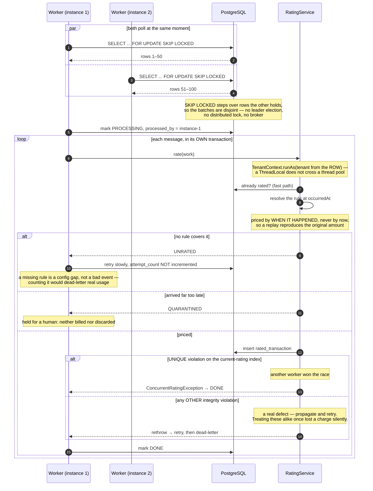
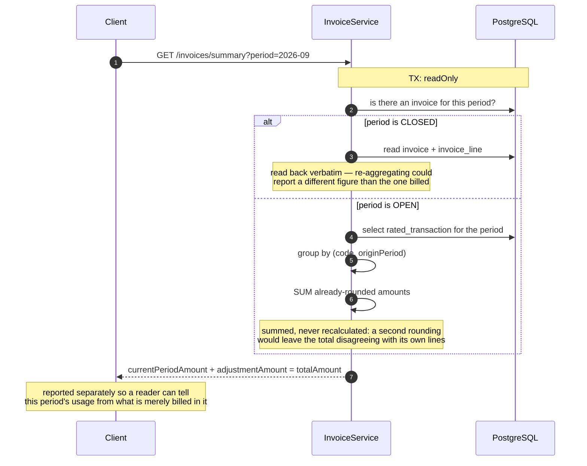
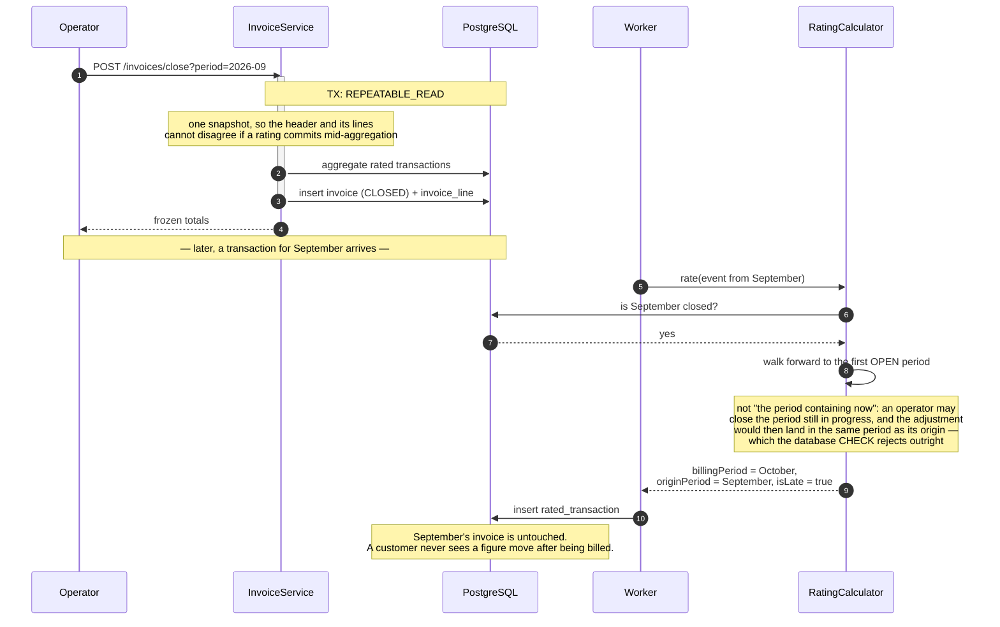
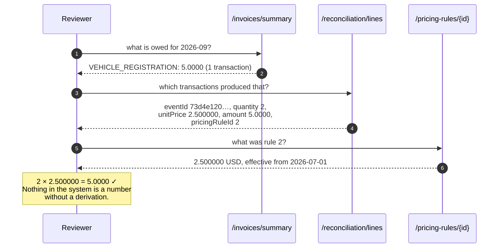
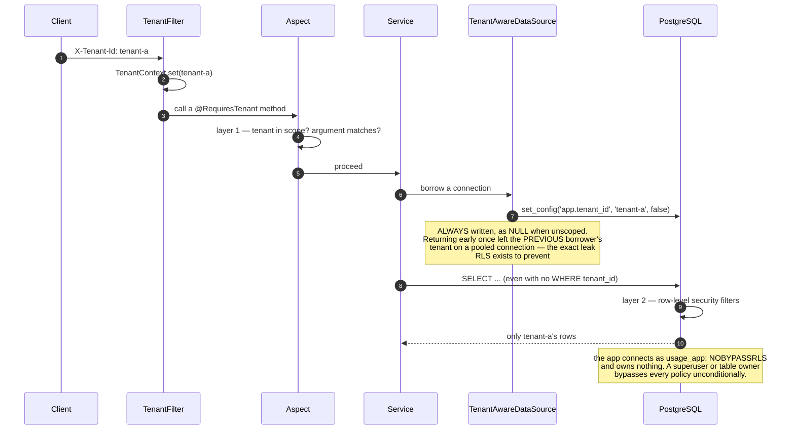

# Sequence diagrams

One per operation, with the transaction boundaries marked — those boundaries are where
most of the design decisions live.

---

## 1. Ingesting a transaction

The response returns as soon as the event is durable. Rating happens later, on a worker.

---

## 2. A duplicate delivery

---

## 3. Rating, across three instances

Delivery is **at-least-once**, never exactly-once. A worker that dies mid-transaction
releases its locks and the rows become claimable again — safe only because
`rated_transaction` carries a partial unique index. The idempotency lives in the
database, not in the worker.

---

## 4. Summarising a period

---

## 5. Closing a period, and the late arrival that follows

---

## 6. Tracing an amount back to its evidence

The path a reviewer walks. Three requests, and every figure re-derives by hand.

---

## 7. Where tenant isolation is enforced

The aspect fails fast with a clear error; row-level security is what holds when the
aspect does not run at all — as with self-invocation, which bypasses the Spring proxy
entirely and is proven to do so by a test.
